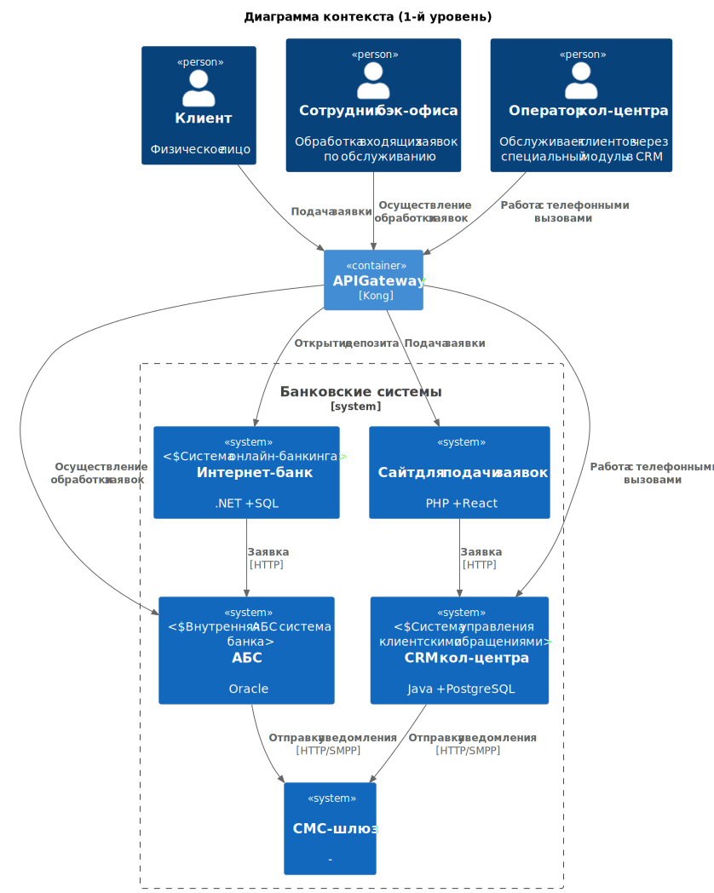

### **Архитектура MVP для цифровизации открытия депозитов** 
### **Автор: Полина**
### **Дата: 01.09.25**
### **Функциональные требования**

|**№**|**Действующие лица или системы**|**Use Case**|**Описание**|
|---|---|---|---|
| 1 | Клиент, Сайт          | Отправка заявки          | 1. Клиент выбирает депозитный продукт 2. Заполняет ФИО и номер телефона 3. Данные шифруются, устанавливается безопасное соединение  4. Заявка направляется в CRM кол-центра                                        |
| 2 | Клиент, Интернет-банк | Онлайн-открытие депозита | 1. Авторизованный пользователь выбирает депозит 2. Получает персонализированную ставку 3. Указывает счет и сумму 4. Подтверждает через SMS 5. Заявка попадает в очередь |
| 3 | Оператор кол-центра   | Работа с заявкой сайта   | 1. Получает сигнал о новой заявке 2. Созванивается с клиентом 3. Результат фиксируется в CRM                                                                                  |
| 4 | Бэк-офис              | Обработка заявки из ИБ   | 1. Заявка поступает в АБС 2. Проверяются данные 3. При необходимости пересчитывается ставка 4. Операция подтверждается                                                     |
| 5 | АБС                   | Управление ставками      | 1. Хранение действующих ставок 2. Расчет персональных условий 3. Согласование специальных ставок                                                                              |
| 6 | Система               | Уведомления клиенту      | 1. SMS при подтверждении 2. SMS при фактическом открытии депозита                                                                                                                |

### **Нефункциональные требования**
| № | Требование    НФТ                            |
| --- | --- |
| 1 | Использование шифрования трафика (TLS)  |
| 2 | Время реакции интерфейсов ≤ 500 мс           |
| 3 | Доступность сайта и ИБ не ниже 99.9%         |
| 4 | Маршрутизация и контроль нагрузки на АБС     |
| 5 | Поддержка .NET 4.5 и Java 8                  |
| 6 | Автоматическое переключение на резервный ЦОД в случае сбоев|
| 7 | Ролевая модель управления для сотрудников    |

### **Решение**

Краткие комментарии:
* Кэш ускоряет отклик интерфейсов (по НФТ ≤500 мс)
* Микросервис депозитов убирает зависимость от Excel, излишнюю коммуникацию по почте, можно масштабировать при росте нагрузки
* Асинхронное взаимодействие Kafka гарантирует доставку, масштабирование при высоких нагрузках

### **Альтернативы**
Прямое соединение с АБС без API Gateway:
* Плюсы: быстрая синхронная коммуникация по API
* Минусы: противоречит FURPS+, низкий контроль нагрузки на сервис, возникнут сложности в маршрутизации при масштабированиях отдельных элементов банковской системы

Минусы выбранной архитектуры:
* Зависимость от легаси (АБС), есть ограничения по технологиям
* Вертикальное масштабирование АБС остается слабым местом - деплой монолита дорогой
* Частичная автоматизация в MVP по-прежнему сохраняет высокие операционные расходы

**Недостатки, ограничения, риски**
* Сложности интеграции с устаревшей монолитной АБС могут вызвать задержки, проблемно масштабировать в случае роста клиентского потока по кредит. и дебет. направлениям
* Сотрудники могут сопротивляться перестройкам в бизнес-процессах

**Меры по снижению рисков**
* Пересмотр работы с БД. Использование read-only реплик Oracle для операций чтения
* Временно внедрить вертикальное масштабирование
* Концептуально начать пересматривать архитектуру АБС, анализировать систему по DDD, выделить важные сервисы, опционально попробовать вывести в бой 1-2 сервиса в рамках MVP
* Обучение, воркшопы, открытые сесси по MVP, активный сбор обратной связи
