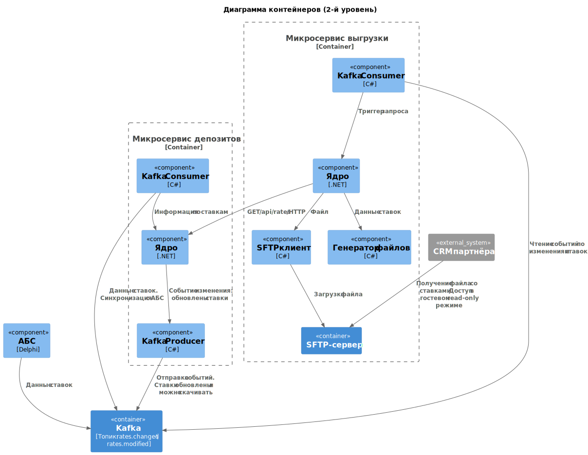

### **Асинхронная передача ставок через Kafka** 
### **Автор: Полина**
### **Дата: 01.09.25**
### **Функциональные требования**

|**№**|**Действующие лица или системы**|**Use Case**|**Описание**|
|---|---|---|---|
| 1 | Сервис депозитов       | Отправка события     | 1. Фиксируется изменение ставок 2. Формируется событие и публикуется в Kafka                                                                  |
| 2 | Сервис выгрузки ставок | Реакция на событие   | 1. Подписывается на нужный топик Kafka 2. Запрашивает у сервиса депозитов актуальные ставки 3. Генерирует файл 4. Загружает файл на SFTP |
| 3 | CRM кол-центра         | Получение обновлений | 1. Определяет, что файл ставок изменился 2. Скачивает новый файл через SFTP 3. Распаковывает и применяет обновленные данные               |

### **Нефункциональные требования**
| **№** | **Требование НФТ**|
|---|---|
| 1 | Гарантированная доставка сообщений в Kafka |
| 2 | Самовосстановление сервисов при сбоях      |
| 3 | Наличие мониторинга для очереди событий    |

### **Решение**

Для корректной и безопасной передачи ставок во внешний контур предлагается:
* Настроить SFTP-сервер, доступный для заинтересованных сторон
* Дополнить сервис депозитов логикой отправки событий и актуализации данных по мониторингу изменения ставокr
* Создать отдельный сервис выгрузки, подписанный на Kafka-топик. При получении события он обращается к сервису депозитов за актуальными ставками, формирует файл, архивирует его и выгружает на SFTP по заданному пути
* На стороне внешнего пользователя также необходимо настроить работу с SFTP: определение файла, скачивание и внедрение к себе в работу

**Разделение задач**:
* Сервис депозитов для управления ставками и публикация событий
* Сервис выгрузки для работы с Kafka, формирование файлов и загрузкv
* Наличие брокера для асинхронной коммуникации между сервисами (Kafka)

**Надежность**:
* Kafka обеспечивает гарантированную доставку (exactly-once или at-least-once)
* Повторные попытки при сбоях на стороне SFTP (есть retry правила, экспоненциональые таймауты между попытками)

**Масштабируемость**:
При росте нагрузки можно запускать несколько экземпляров сервиса выгрузки
Балансировка нагрузки между консьюмерами Kafka.

**Производительность**:
* Асинхронный обмен не блокирует бизнес-логику депозитного сервиса
* Параллельная обработка событий ускоряет выгрузку.

### **Альтернативы**

**Рассмотренные альтернативы**:
Прямое подключение CRM к сервису депозитов:
* Плюсы: простая архитектура, синхронное взаимодействие по REST
* Минусы: прямое влияние на основной сервис, отсутствие механизма гарантированной доставки, нет контроля нагрузки

Облачное хранилище с защищенным доступом:
* Файлы выгружаются в выделенный контейнер (например, Я.Облако, корпоративный Nextcloud)
* Доступ дается партнерам только на чтение (гостевой режим).

* Плюсы: удобный и контролируемый обмен, журналирование, контроль версий, большая часть расходов на сопровождение, инфраструктуру на подрядчике системы.
* Минусы: может не пройти по требованиям ИБ, есть лимиты по размерам, хранению файлов.

Недостатки текущего подхода
* Рост расходов и удорожание разработки за счет добавления нового функционала и сервисов
* Усложнение поддержки за счет дополнительного микросервиса
* Дополнительные ресурсы на хранение и передачу файлов
* Наличие задержки между изменением ставки и появлением обновленного файла
* Открытые вопросы ИБ по безопасному обмену данным между внутренними и внешними сервисами

## Дополнительная информация
### Roadmap по внедрению новых сервисов
